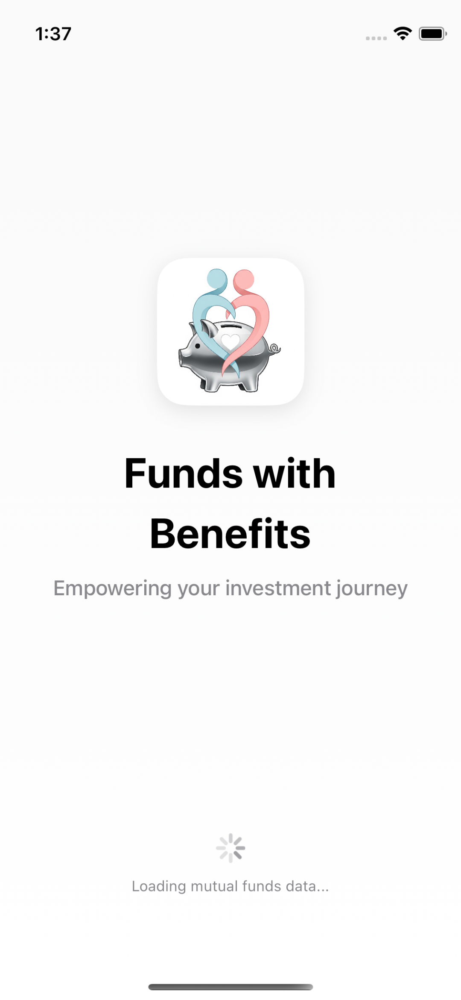
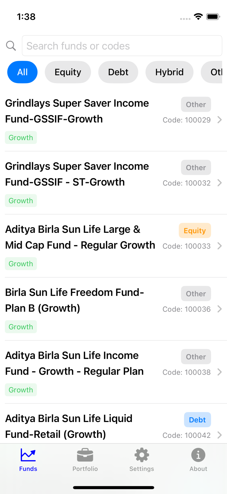
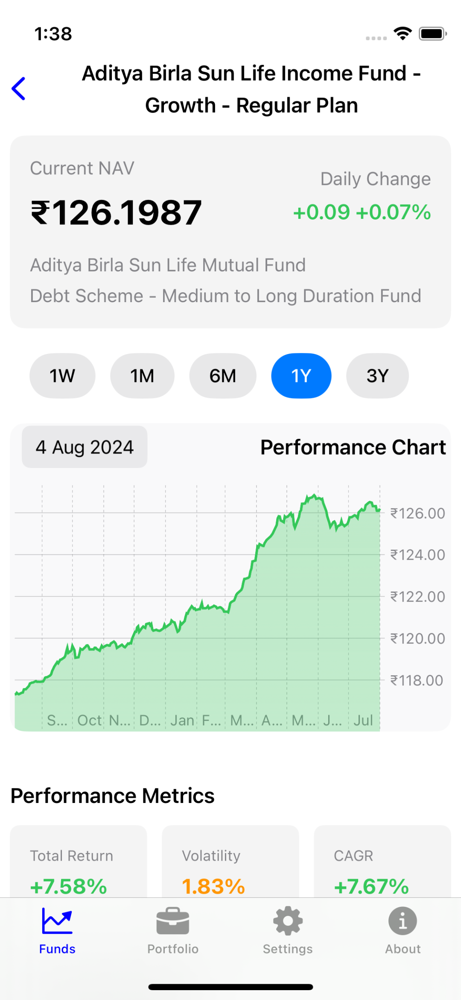
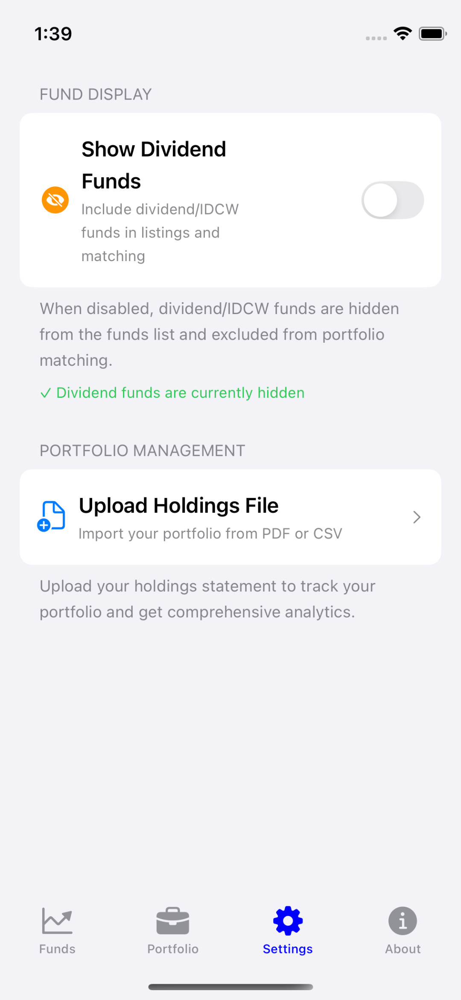

# 📊 Funds with Benefits (FWB)

[](https://developer.apple.com/ios/)
[](https://swift.org)
[](https://developer.apple.com/xcode/swiftui/)
[](#testing)

A comprehensive iOS app for tracking and analyzing Indian mutual funds using real-time data from the MF API. Empowering your investment journey with intelligent insights and benefits.

## 📱 Screenshots

<div align="center">
<table>
<tr>
<td><br/><b>FWB App Launch</b></td>
<td><br/><b>Fund Discovery</b></td>
</tr>
<tr>
<td><br/><b>Interactive Charts</b></td>
<td><br/><b>Settings & Preferences</b></td>
</tr>
</table>
</div>

## ✨ Features

### 📊 **Fund Discovery**
- Complete list of Indian mutual funds
- Real-time search by fund name or scheme code
- Category-based filtering (Equity, Debt, Hybrid, Other)
- Growth and Dividend plan identification

### 📈 **Performance Analysis**
- Interactive charts with multiple timeframes (1W, 1M, 6M, 1Y, 3Y)
- Start date selector for custom time ranges (5D to 10Y)
- Chart zoom functionality with drag gestures
- Real-time NAV data and daily changes
- Total returns and CAGR calculations
- Volatility analysis for risk assessment

### 🎯 **Detailed Fund Information**
- Current NAV with daily change indicators
- Category information
- ISIN codes for growth and dividend plans
- Historical performance metrics

### 🔍 **Smart Search & Filters**
- Instant search across fund names and codes
- Category filters for focused browsing
- Dividend fund filter (hide/show dividend/IDCW plans)
- Responsive and intuitive user interface

### 💼 **Portfolio Holdings Management**
- **Smart portfolio import** from PDF statements (supports [Groww](https://groww.in/) app statements)
- **Intelligent fund matching** with 99%+ accuracy using advanced algorithms
- **Live NAV calculations** with automatic portfolio refresh
- **Interactive portfolio cards** - tap holdings for detailed fund analysis
- **Flexible sorting options** - Current Value and Annualised Return with visual indicators (↑/↓)
- **Comprehensive metrics display** - units, invested→current value, returns, and XIRR
- **Real-time portfolio valuation** with automatic market data updates
- **Clean, intuitive interface** optimized for portfolio tracking

### ⚙️ **Settings & Preferences**
- **Dividend fund filtering** - toggle visibility of dividend/IDCW plans for cleaner experience
- **Portfolio management tools** - upload PDF/CSV statements via Settings tab
- **Persistent preferences** - settings maintained across app sessions
- **Real-time filtering integration** - affects both fund listings and portfolio matching
- **User-friendly defaults** - optimized for typical investment workflows

## 🏗️ Technical Architecture

### Core Technologies
- **SwiftUI** - Modern declarative UI framework with iOS 17+ features
- **MVVM Pattern** - Clean separation of concerns with reactive data binding
- **Swift Charts** - Native interactive chart framework for performance visualization
- **URLSession** - Async/await networking with robust error handling
- **UserDefaults** - Efficient local caching with 24-hour expiration policies

### Data Models
- **MutualFund** - Core fund entity with metadata and performance tracking
- **NAVData** - Historical NAV records with date-indexed performance data
- **HoldingData** - Portfolio holdings with real-time valuation capabilities
- **Portfolio** - Aggregated portfolio management with analytics
- **FundDetails** - Combined model for comprehensive fund information

### Code Quality Features
- **High-performance fund matching** - 99%+ accuracy with 20-50x speed optimization
- **Intelligent caching system** - 24-hour fund list cache, 4-hour detail cache with selective busting
- **Robust error handling** - Comprehensive network failure recovery and offline functionality
- **Comprehensive test coverage** - 38 unit tests + 14 UI tests with race condition prevention
- **Memory-optimized algorithms** - Efficient search and filtering for large datasets
- **Responsive UI architecture** - Smooth animations and loading states throughout

## 🚀 Getting Started

### Prerequisites
- iOS 17.0+
- Xcode 15.0+  
- Swift 5.9+
- Internet connection for real-time data

### Installation
1. Clone the repository
```bash
git clone https://github.com/yourusername/funds-with-benefits.git
cd funds-with-benefits
```

2. Open in Xcode
```bash
open MutualFundsApp.xcodeproj
```

3. Build and run on simulator or device (`⌘+R`)

### Usage
1. **Explore funds** - Browse the complete list of Indian mutual funds with real-time search
2. **Analyze performance** - Tap any fund to view interactive charts and detailed metrics
3. **Upload portfolio** - Go to Settings to import your holdings from PDF statements
4. **Track investments** - Monitor your portfolio with live NAV updates and performance analytics
5. **Customize experience** - Use Settings to hide dividend funds and optimize your workflow

## 📁 Project Structure

```
MutualFundsApp/
├── MutualFundsApp.swift          # App entry point
├── ContentView.swift             # Main UI with 4-tab navigation (Funds, Portfolio, Settings, About)
├── Models/
│   ├── MutualFund.swift         # Core fund model with performance tracking
│   ├── NAVData.swift            # Historical NAV data with date indexing
│   ├── FundDetails.swift        # Combined fund detail model
│   ├── HoldingData.swift        # Portfolio holdings data model
│   └── Portfolio.swift          # Portfolio aggregation and analytics
├── Views/
│   ├── SplashScreenView.swift   # App launch with FWB branding
│   ├── FundsListView.swift      # Main fund discovery interface
│   ├── FundDetailView.swift     # Interactive charts and fund analysis
│   └── Holdings/                # Portfolio management views
│       ├── HoldingsView.swift   # Portfolio tracking interface
│       ├── FilePickerView.swift # PDF upload functionality
│       ├── HoldingRowView.swift # Individual holding cards
│       └── PortfolioSummaryView.swift # Portfolio analytics
├── Services/
│   ├── APIService.swift         # MF API integration with AppSettings
│   ├── DataCache.swift          # Intelligent caching with selective busting
│   ├── HoldingsParser.swift     # PDF statement parsing engine
│   ├── HoldingsManager.swift    # Portfolio data management (MainActor)
│   └── FundMatcher.swift        # High-performance fund matching (99%+ accuracy)
└── Extensions/
    ├── Date+Extensions.swift    # Date formatting and utilities
    └── Double+Extensions.swift  # Financial number formatting
```

## 🧪 Testing

### Test Coverage
- **Unit Tests**: 38 tests covering data models, API services, fund matching algorithms, and portfolio calculations
- **UI Tests**: 14 end-to-end tests for critical user workflows including fund discovery, portfolio management, and settings
- **All tests passing** with stable execution and race condition prevention
- **Comprehensive test patterns** following CLAUDE.md guidelines for MainActor async testing

### Running Tests
```bash
# Run unit tests only (recommended for debugging)
timeout 180 xcodebuild test -scheme MutualFundsApp \
  -destination 'platform=iOS Simulator,name=iPhone 16,OS=latest' \
  -only-testing:MutualFundsAppTests

# Run UI tests only  
timeout 180 xcodebuild test -scheme MutualFundsApp \
  -destination 'platform=iOS Simulator,name=iPhone 16,OS=latest' \
  -only-testing:MutualFundsAppUITests

# Or use Xcode: ⌘+U to run all tests
```

## Key Features Implementation

### 🔍 **Advanced Search & Filtering**
- **Debounced search** to minimize API calls and improve performance
- **Multi-criteria filtering** across fund names, scheme codes, and categories
- **Real-time dividend fund filtering** with persistent user preferences
- **Smooth animations** and loading states for responsive user experience

### 📊 **Interactive Performance Analysis**
- **Native Swift Charts** with drag-to-zoom functionality for custom timeframes
- **Dynamic time period selection** (1W, 1M, 6M, 1Y, 3Y) with intelligent data filtering
- **Smart date constraints** preventing invalid date ranges based on fund age
- **Comprehensive metrics calculation** - Total Return, CAGR, Volatility with professional accuracy
- **Visual performance indicators** with color-coded gains/losses

### 💼 **Portfolio Intelligence**
- **Advanced fund matching algorithm** achieving 99%+ accuracy through fuzzy matching and AMC detection
- **Real-time portfolio valuation** with live NAV updates and automatic refresh
- **Intelligent PDF parsing** supporting Groww statement formats with robust error handling
- **Professional portfolio analytics** including XIRR calculations and performance tracking

### 📱 **Premium User Experience**
- **Pull-to-refresh functionality** across all major views
- **Comprehensive offline support** with intelligent caching and graceful degradation
- **Responsive design** optimized for all iPhone sizes with adaptive layouts
- **Clean, headerless interface** design maximizing content focus and reducing visual clutter

## 📊 Data Source & API Integration

This app integrates with the [MF API (api.mfapi.in)](https://api.mfapi.in/mf) providing:

- **Comprehensive Fund Catalog**: Complete database of Indian mutual funds with real-time updates
- **Historical Performance Data**: Daily NAV history spanning multiple years for accurate trend analysis
- **Rich Fund Metadata**: Category classification, scheme information, and ISIN codes
- **Live Market Updates**: Latest NAV values with daily change calculations and percentage movements
- **High Availability**: Reliable API service with robust error handling and fallback mechanisms

### API Performance Optimizations
- **Intelligent Caching**: 24-hour fund list cache, 4-hour detail cache with selective cache busting
- **Efficient Network Usage**: Debounced requests and batch operations to minimize API calls
- **Offline Resilience**: Graceful degradation with cached data when network unavailable
- **Error Recovery**: Comprehensive retry logic with exponential backoff for transient failures

## 📈 Financial Metrics & Calculations

The app provides professional-grade financial analysis with accurate calculations:

- **Total Return**: Precise percentage gain/loss calculations over selected time periods
- **CAGR (Compound Annual Growth Rate)**: Annualized returns for standardized performance comparison
- **Risk Assessment**: Volatility analysis based on price fluctuation patterns
- **Daily Performance**: Real-time NAV changes with percentage movements and trend indicators
- **Portfolio Analytics**: XIRR calculations, weighted returns, and allocation analysis
- **Live Valuations**: Automatic portfolio revaluation with current market prices

## 🔮 Future Enhancements

- **Enhanced Portfolio Features**
  - Portfolio photo attachments for statements and confirmations
  - AI-powered data extraction from uploaded images
  - Advanced portfolio analytics with sector allocation and risk metrics
  - Goal-based investment tracking and recommendations

- **Advanced Functionality**
  - Push notifications for significant fund movements and portfolio alerts
  - Custom alerts and notifications for user-defined fund conditions and thresholds
  - Fund comparison tools with side-by-side analysis
  - Advanced filtering options (AUM, expense ratio, fund manager history)
  - Export functionality (PDF reports, CSV data, Excel compatibility)

- **User Experience Improvements**
  - iCloud sync for cross-device portfolio access
  - Dark mode support with system-wide theme integration
  - Favorites functionality for quick fund access and watchlists
  - Timer integration for SIP reminders and investment scheduling

## 🤝 Contributing

We welcome contributions! Please see our [Developer Documentation](DEVELOPER_DOCS.md) for detailed development guidelines.

### Development Notes
- **Testing**: Maintain comprehensive test coverage when making changes
- **Performance**: Follow existing caching and optimization patterns
- **UI Consistency**: Use established SwiftUI patterns and component reuse
- **API Integration**: Respect rate limits and implement proper error handling
- **Architecture**: Follow MVVM pattern with reactive data binding

## 📄 License

MIT License

Copyright (c) 2025 Funds with Benefits

Permission is hereby granted, free of charge, to any person obtaining a copy
of this software and associated documentation files (the "Software"), to deal
in the Software without restriction, including without limitation the rights
to use, copy, modify, merge, publish, distribute, sublicense, and/or sell
copies of the Software, and to permit persons to whom the Software is
furnished to do so, subject to the following conditions:

The above copyright notice and this permission notice shall be included in all
copies or substantial portions of the Software.

THE SOFTWARE IS PROVIDED "AS IS", WITHOUT WARRANTY OF ANY KIND, EXPRESS OR
IMPLIED, INCLUDING BUT NOT LIMITED TO THE WARRANTIES OF MERCHANTABILITY,
FITNESS FOR A PARTICULAR PURPOSE AND NONINFRINGEMENT. IN NO EVENT SHALL THE
AUTHORS OR COPYRIGHT HOLDERS BE LIABLE FOR ANY CLAIM, DAMAGES OR OTHER
LIABILITY, WHETHER IN AN ACTION OF CONTRACT, TORT OR OTHERWISE, ARISING FROM,
OUT OF OR IN CONNECTION WITH THE SOFTWARE OR THE USE OR OTHER DEALINGS IN THE
SOFTWARE.

**Note**: This project includes code generated with AI assistance ([Claude](https://claude.ai)) and is created for educational and personal use. The mutual fund data is provided by MF API and subject to their terms of service.

## ⭐ Show Your Support

If you find this project helpful, please consider giving it a star! It helps others discover the project and motivates continued development.

---

## 💡 About Funds with Benefits (FWB)

FWB represents a new approach to mutual fund investing - combining powerful analysis tools with user-friendly design to make investment decisions easier and more informed. Our mission is to democratize access to professional-grade investment insights for every Indian investor.

### Why FWB?
- **Professional-grade analytics** typically found in expensive investment platforms
- **Real-time data integration** with comprehensive historical analysis
- **Intelligent portfolio management** with advanced fund matching algorithms
- **Clean, intuitive interface** designed for both beginners and experienced investors
- **Privacy-focused** with local data storage and minimal external dependencies

